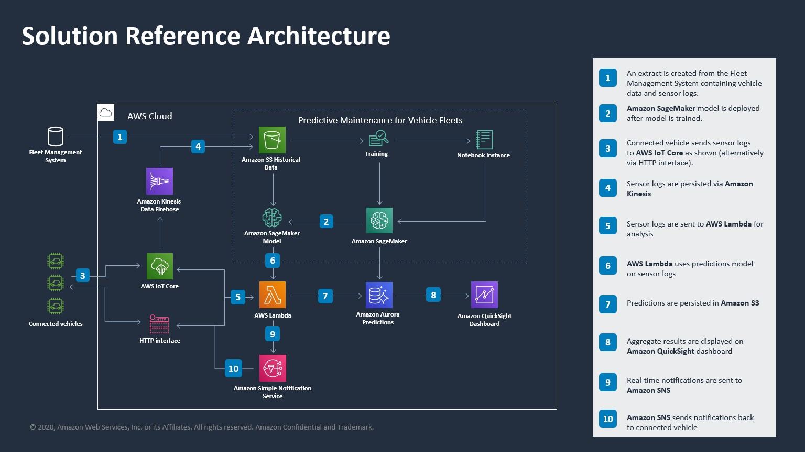

## AWS Predictive Maintenance for Automotive Fleets

The AWS predictive maintenance solution for automotive fleets applies deep learning techniques to common areas that drive vehicle failures, unplanned downtime and repair costs. It serves as an initial building block for you to get to a proof-of-concept in a short period of time. This solution contains data preparation and visualization functionaility within Amazon SageMaker and allows you to train and optimize the hyperparameters of deep learning models for your dataset. You can use your own data or try the solution with a synthetic data set as part of this solution. This version processes vehicle sensor data over time. A subsequent version will process maintenance record data.

## Requirements

You will need an AWS account to use this solution. Sign up for an account [here](https://aws.amazon.com/).

You will also need to have permission to use [AWS CloudFormation](https://aws.amazon.com/cloudformation/) and to create all the resources detailed in the [architecture section](#architecture). All AWS permissions can be managed through [AWS IAM](https://aws.amazon.com/iam/). Admin users will have the required permissions, but please contact your account's AWS administrator if your user account doesn't have the required permissions.

## Getting Started

Click on one of the following buttons to *quick create* the AWS CloudFormation Stack:

<table>
  <tr>
    <th colspan="3">AWS Region</td>
    <th>AWS CloudFormation</td>
  </tr>
  <tr>
    <td>US West</td>
    <td>Oregon</td>
    <td>us-west-2</td>
    <td align="center">
      
    </td>
  </tr>
</table>

You should acknowledge the use of the two capabilities and click 'Create Stack'. Once stack creation has completed successfully, click the 'SageMakerNotebookInstanceSignOn' link on the 'Outputs' tab. You can start by reading the notebook '1_introduction.ipynb'.

**Caution**: Cloning this GitHub repository and running the code manually could lead to unexpected issues! Use the AWS CloudFormation template. You'll get an Amazon SageMaker Notebook instance that's been correctly setup and configured to access the other resources in the solution.

## Contents

* `cloudformation/`
  * `aws-fleet-predictive-maintenance.yaml`: Creates AWS CloudFormation Stack for solution.
* `docs/`
  * Contains images for documenting the solution.
* `sagemaker/`
  * `requirements.txt`: Describes Python package requirements of the Amazon SageMaker Notebook instance.
  * `1_introduction.ipynb`: Provides a high-level look at the solution components 
  * `2_data_preparation.ipynb`: Prepares and/or generates a dataset for machine learning
  * `3_data_visualization`: Visualizes the input data
  * `4_model_training.ipynb`: Trains the model with Amazon SageMaker training jobs and Hypoerparameter Optimization jobs.
  * `5_results_analysis.ipynb`: Analyze the models trained and set up an Amazon SageMaker endpoint
  * `config/`
    * `config.yaml`: Stores and retrieves project configuration.
  * `data/`
    * Provides a location to store input and generated data
    * `generation/`
        * `fleet_statistics.csv`: contains sample mean and std of sensor log data for different vehicles
  * `source/`
    * `config/`: 
        * `__init__.py`: Manages the config file
    * `dataset/`: 
        * `dataset_generator.py`: Generates a dataset based on the mean and std of sensor log data
    
    * `dl_utils/`:
        * `dataset.py`: Contains a pytorch dataset for deep learning
        * `inference.py`: The entry point for the Amazon SageMaker Endpoint
        * `network.py`: Defines the neural network architecture
        * `requirements.txt`: Provides the required packages for the Amazon SageMaker Endpoint
        * `stratified_sampler.py`: Sampler for the pytorch dataset to create equal positive and negative samples. Obtained from [torchsample](https://github.com/ncullen93/torchsample)
        
    * `preprocessing/`:
        * `dataframewriter.py`: Helper class to preprocess data frames
        * `preprocessing.py`: Merges sensor and fleet information data
    
    * `visualization/`:
        * `model_visualisation_utils.py`: Utilities to help visualize trained models
        * `plot_utils.py`: Utilities to visualize the input data
    * `train.py`: Entry point for the Amazon SageMaker training job
    

## Architecture

As part of the solution, the following services are used:

* [Amazon S3](https://aws.amazon.com/s3/): Used to store datasets.
* [Amazon SageMaker Notebook](https://aws.amazon.com/sagemaker/): Used to preprocess and visualize the data, and to train the deep learning model.
* [Amazon SageMaker Endpoint](https://aws.amazon.com/sagemaker/): Used to deploy the trained model.

1. An extract is created from the Fleet Management System containing vehicle data and sensor logs.
2. **Amazon SageMaker model** is deployed after model is trained.
3. Connected vehicle sends sensor logs to **AWS IoT Core** as shown (alternatively via HTTP interface).
4. Sensor logs are persisted via **Amazon Kinesis**.
5. Sensor logs are sent to **AWS Lambda** for analysis.
6. **AWS Lambda** uses predictions model on sensor logs.
7. Predictions are persisted in **Amazon S3**.
8. Aggregate results are displayed on **Amazon QuickSight** dashboard.
9. Real-time notifications are sent to **Amazon SNS**.
10. **Amazon SNS** sends notifications back to connected vehicle.

## Costs

You are responsible for the cost of the AWS services used while running this solution.

As of July 13th 2020 in the US West (Oregon) region, the cost to:

* train the model using Amazon SageMaker training job on ml.c5.xlarge is ~$0.02.
* host the model using Amazon SageMaker Endpoint on ml.c5.xlarge is $0.119 per hour.
* run an Amazon SageMaker notebook instance is $0.0582 per hour.

All prices are subject to change. See the pricing webpage for each AWS service you will be using in this solution.

## Cleaning Up

When you've finished with this solution, make sure that you delete all
unwanted AWS resources. AWS CloudFormation can be used to automatically delete
all standard resources that have been created by the solution and notebook.
Go to the AWS CloudFormation Console, and delete the *parent* stack.
Choosing to delete the parent stack will automatically delete the nested stacks.

**Caution**: You need to manually delete any extra resources that you may have
created in this notebook. Some examples include, extra Amazon S3 buckets (to
the solution's default bucket) and extra Amazon SageMaker endpoints (using a
custom name).

## Customizing

Our solution is easily customizable. You can customize the:

* Input data visualizations.
  * See [`sagemaker/3_data_visualization.ipynb`](sagemaker/3_data_visualization.ipynb).
* Machine learning.
  * See [`sagemaker/source/train.py`](sagemaker/source/train.py).
  * See [`sagemaker/source/dl_utils/network.py`](sagemaker/source/dl_utils/network.py).
* Dataset processing.
  * See [`sagemaker/1_introduction.ipynb`](sagemaker/1_introduction.ipynb) on how to define the config file.

## FAQ

### Does the solution have a way to adapt to input data since every vehicle has different telemetry on it?

The solution is based on machine and deep learning models and allows a wide variety of input data including any time-varying sensor data. You can fine-tune the provided model to the frequency and type of data that you have.

### Could the models built in this solution deployed in real-time inside the vehicle?

The solution will support [Amazon SageMaker Neo](https://aws.amazon.com/sagemaker/neo/) to deploy inference at the edge in real-time inside the vehicle.

## Useful Resources

* [Amazon SageMaker Developer Guide](https://docs.aws.amazon.com/sagemaker/latest/dg/whatis.html)
* [Amazon SageMaker Python SDK Documentation](https://sagemaker.readthedocs.io/en/stable/)
* [AWS CloudFormation User Guide](https://docs.aws.amazon.com/AWSCloudFormation/latest/UserGuide/Welcome.html)

## License

This project is licensed under the Apache-2.0 License.

## Security

See [CONTRIBUTING](CONTRIBUTING.md#security-issue-notifications) for more information.

## License

This project is licensed under the Apache-2.0 License.

